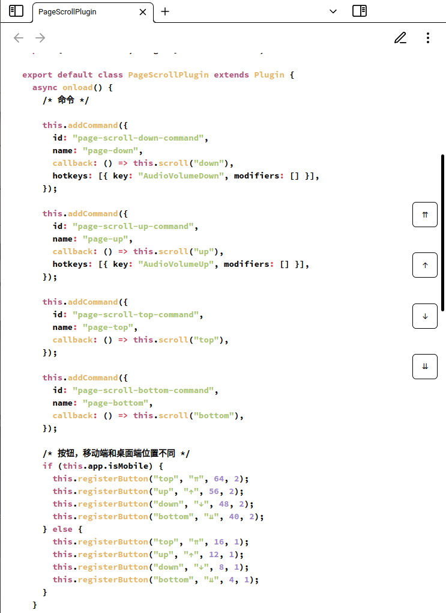

### Introduce

原意是给墨水屏设备使用，因为正常地翻页会有残影，四个按钮分别是跳到顶部/向上翻页/向下翻页/跳到底部

The original intention is to use the ink screen device, because there will be residual shadows because of normal pages, the four buttons are jump to the top/pages up/down pages/jump to the bottom

## Example

### desktop

### mobile

